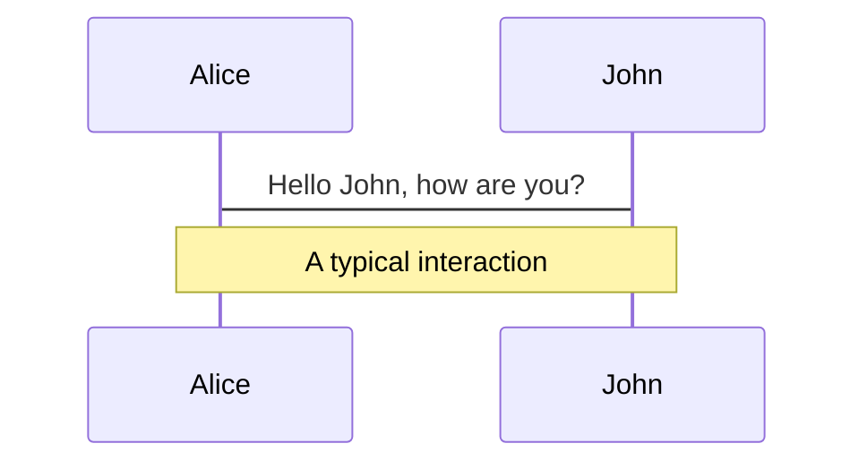
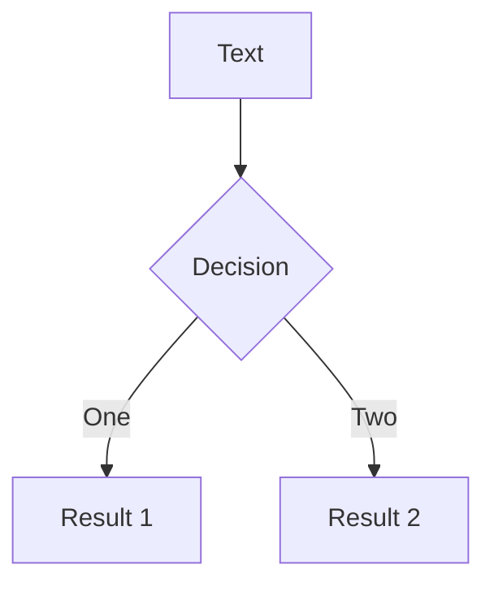
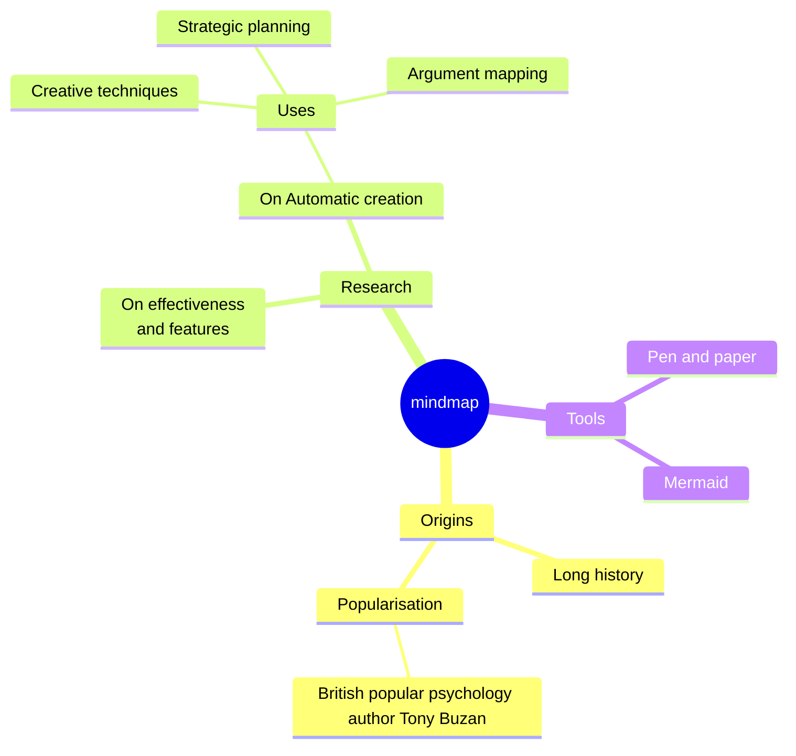
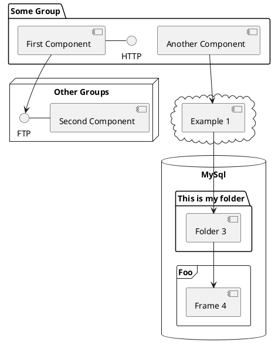

# Taller de Git 2025-26

Jorge Gómez Zarzosa [@jorgegomzar](https://github.com/jorgegomzar)

## GUI - Grupo Universitario de Informática

## ETSII UVa

---
layout: center
---

# Tabla de contenidos

<Toc text-sm minDepth="1" maxDepth="2" />

---
transition: fade-out
layout: quote
---

# ¿Qué es Git?

"git" puede significar <span v-mark.red="0">cualquier cosa</span>, dependiendo de tu estado de ánimo:

<v-click>
<br>
</v-click>

<v-clicks>

- Una combinación aleatoria de tres letras que sea pronunciable y que no se use realmente en ningún comando común de UNIX. El hecho de que sea una mala pronunciación de "get" puede o no ser relevante.
- Estúpido. Despreciable y detestable. Simple. Elige la acepción que quieras del diccionario de jerga.
- "global information tracker" (rastreador global de información): estás de buen humor y realmente funciona para ti. Los ángeles cantan, y de repente una luz llena la habitación.
- "goddamn idiotic truckload of sht"* (maldito idiota montón de mierda): cuando se rompe.

</v-clicks>

<v-after>

[Linus Torvalds en su primer commit del repo de Git](https://github.com/git/git/blob/e83c5163316f89bfbde7d9ab23ca2e25604af290/README)

</v-after>

---
transition: slide-left
level: 2
layout: image-right
image: https://imgs.search.brave.com/K8pj6qWCr5ahPO_ZHfK08hZpFxsd-em0aXAcR4bGZ4s/rs:fit:860:0:0:0/g:ce/aHR0cHM6Ly9jb250/ZW50LmNkbnR3cmsu/Y29tL2ZpbGVzL2FI/VmlQVGcxTkRNekpt/TnRaRDFwZEdWdFpX/UnBkRzl5YVcxaFoy/VW1abWxzWlc1aGJX/VTlhWFJsYldWa2FY/UnZjbWx0WVdkbFh6/WXpPVGt3WTJJNE9X/VTVZVFV1YW5Cbkpu/Wmxjbk5wYjI0OU1E/QXdNQ1p6YVdjOU9X/SmpaVEE1TkRJeE56/WTRNV0ZoWmpZeU5t/RXdOV05oWW1JMVlU/VXpNV1ElM0Q
backgroundSize: 80% 50%
---

# En serio: ¿qué es Git?

Linus lo definió originalmente como:

> This is a stupid (but extremely fast) directory content manager.

<v-click>

Nosotros vamos a hablar de:

## Software de Control de Versiones (VCS / SCM)

[Git - Getting started about Version Control](https://git-scm.com/book/ms/v2/Getting-Started-About-Version-Control)
[GitHub - What is Version Control?](https://github.com/resources/articles/software-development/what-is-version-control)

</v-click>

---
transition: slide-up
level: 2
---

# Alternativas a Git

Aunque el taller va a tratar de Git, los conocimientos se pueden extrapolar a otras herramientas software de control de versiones.

- [Mercurial SCM](https://www.mercurial-scm.org/)
- [Jujutsu (Google)](https://jj-vcs.github.io/jj/latest/)

<br>

<div class="grid grid-cols-2 gap-4">
<div class="w-full">

Clone + Commit + Push

::code-group

```sh [git]
git clone https://www.mercurial-scm.org/repo/hello
cd hello
# (edit files)
git add (new files)
git commit -m 'My changes'
git push
```

```sh [hg]
hg clone https://www.mercurial-scm.org/repo/hello
cd hello
# (edit files)
hg add (new files)
hg commit -m 'My changes'
hg push
```

```sh [jj]
jj git clone https://github.com/octocat/Hello-World
cd Hello-World
jj st
# (edit files)
jj new
jj git push
```
::

</div>
<div class="w-full">

Init + Stage + Commit

::code-group
```sh [git]
git init (project-directory)
cd (project-directory)
# (add some files)
git add
git commit -m 'Initial commit'
```

```sh [hg]
hg init (project-directory)
cd (project-directory)
# (add some files)
hg add
hg commit -m 'Initial commit'
```

```sh [jj]
jj init (project-directory)
cd (project-directory)
# (add some files)
jj new
```
::

</div>
</div>

---
layout: center
---

# Plataformas de desarrollo cooperativo

Para hostear repositorios VCS en la nube y colaborar con otros devs.

- [GitHub](https://github.com/)
- [GitLab](https://about.gitlab.com/es/)
- [Bitbucket](https://bitbucket.org/)
- [Gitea](https://about.gitea.com/)
- [AWS CodeCommit](https://aws.amazon.com/es/codecommit/)
- [Launchpad (Canonical)](https://launchpad.net/)
- ...

---
layout: default
---

# Cómo iniciar un repositorio Git
Un repositorio Git es un directorio normal con un subdirectorio `.git/`

Uno nuevo

````md magic-move {lines: true}
```bash {*|1-2|3|4}
mkdir hello-world
cd hello-world
git init
git remote add origin git@<server>:<user>/<repo>.git
```

```bash {4|*}
mkdir hello-world
cd hello-world
git init
git remote add origin https://<server>/<user>/<repo>.git
```
````

A partir de uno ya existente

````md magic-move {lines: true}
```bash
git clone git@<server>:<user>/<repo>.git
```
```bash
git clone https://<server>/<user>/<repo>.git
```
````

---
level: 2
layout: image-right
image: https://imgs.search.brave.com/94K8Y267LvRlyKcJgyoswoWNAzhF93LeCMfP8Ce-64c/rs:fit:860:0:0:0/g:ce/aHR0cHM6Ly93YWMt/Y2RuLmF0bGFzc2lh/bi5jb20vZGFtL2pj/cjphOTA1ZGRmZC05/NzNhLTQ1MmEtYTRh/ZS1mMWRkNjU0MzAw/MjcvMDElMjBHaXQl/MjBicmFuY2guc3Zn/P2NkblZlcnNpb249/Mjk5OQ
backgroundSize: 100% 70%
---

# Conceptos básicos
A Linus le gustaba comparar el estado de un repositorio con un árbol para representar la estructura de directorios y el contenido de archivos de un proyecto en un momento dado.

### Commit
Los <i>nudos</i> del árbol. Cada <span v-mark.circle.orange="1">versión</span> por la que ha pasado el repositorio.

<v-click>&nbsp;</v-click>

<Arrow
    v-click
    x1="165"
    y1="210"
    x2="500"
    y2="270"
    color="red"
    v-motion
      :initial="{ x: -80 }"
      :enter="{ x: 0 }"
      :click-3="{ x: 80 }"
/>

### Branch
Las ramificaciones, que crecen en paralelo al tronco (rama principal)

### HEAD
Un puntero que nos dice en qué commit nos encontramos

---
layout: cover
---

# Comandos de Git

---

## git status

````md magic-move
```bash
git status
```

```bash {*|2|4|6-18|20|*}
git status
On branch main

No commits yet

Untracked files:
  (use "git add <file>..." to include in what will be committed)
        .gitignore
        .npmrc
        README.md
        bun.lock
        components/
        netlify.toml
        package.json
        pages/
        slides.md
        snippets/
        vercel.json

nothing added to commit but untracked files present (use "git add" to track)
```
```bash
git status
On branch main
Untracked files:
  (use "git add <file>..." to include in what will be committed)
        slides.md

nothing added to commit but untracked files present (use "git add" to track)
```

```bash
git status
On branch main
nothing to commit, working tree clean
```

```bash
git status
```

````

<v-click>

## git add + git restore

````md magic-move
```bash
git status
```
```bash {*|6}
git status
On branch main
Changes not staged for commit:
  (use "git add <file>..." to update what will be committed)
  (use "git restore <file>..." to discard changes in working directory)
        modified:   slides.md

no changes added to commit (use "git add" and/or "git commit -a")
```
```bash
git add slides.md
```
```bash {*|3-5}
git status
On branch main
Changes to be committed:
  (use "git restore --staged <file>..." to unstage)
        modified:   slides.md
```
```bash
git add <fichero[s]>
```
````

</v-click>

<v-click>

## git commit

````md magic-move
```bash
git status
```
```bash {*|3-5}
git status
On branch main
Changes to be committed:
  (use "git restore --staged <file>..." to unstage)
        modified:   slides.md
```
```bash {1|2|3}
git commit -m "feat: add slides.md"
[main 125a44c] feat: update slides.md
 1 file changed, 83 insertions(+), 1 deletion(-)
```
```bash {1|3|*}
git status
On branch main
nothing to commit, working tree clean
```
```bash
git commit -m "feat: mensaje"
```
````

</v-click>
<v-click>

## git log

````md magic-move
```bash
git log
```
```bash {*|2-6|8-12|2,8|3,9|4,10|6,12|*}
git log
commit 4fe1e30d4ecf3043840cd9f16bf2f467aa976390 (HEAD -> main)
Author: Jorge Gómez Zarzosa <jorgegomez@bmat.com>
Date:   Tue Sep 30 17:43:37 2025 +0200

    feat: add slides

commit d4cdf688284302dbd628a45f800f0278cb04fab0
Author: Jorge Gómez Zarzosa <jorgegomez@bmat.com>
Date:   Tue Sep 30 17:42:39 2025 +0200

    feat: add sli.dev boilerplate
```
```bash
git log --oneline
4fe1e30 (HEAD -> main) feat: add slides
d4cdf68 feat: add sli.dev boilerplate
```
```bash
git log --oneline --graph
* 4fe1e30 (HEAD -> main) feat: add slides
* d4cdf68 feat: add sli.dev boilerplate
```
```bash
git log --oneline --graph
* e720608cd fix(NO TICKET): bump to reportal-customers 0.35.5 and es-reportal 0.21.0  (pull request #2567)
*   1859a64fe feat(RCDEV-1375,RCDEV-1374): bump yle-reportal (pull request #2565)
|\
| * 9287d2908 feat(RCDEV-1375,RCDEV-1374): bump yle-reportal
|/
* 6e374e7b7 build(RCDEV-1297): Bump reportal-customers to v0.35.3 (pull request #2564)
* aa3bff002 fix(RCDEV-1489): bump clients to fix session closing bug  (pull request #2553)
*   7e93e44ae feat(RCDEV-658): remove prosieben custom package since it's been merged into reportal-customers. (pull request #2549)
|\
| * 23601c75d (origin/feat/move_prosieben_to_reportal_customers) feat(RCDEV-658): remove prosieben custom package since it's been merged into reportal-customers.
* | 33036b828 chore: bump sportsnet-cued to bring fix for interceptors session (pull request #2551)
```
```bash
git log
```
````
</v-click>

<v-click>

## git reflog

````md magic-move
```bash
git reflog
```
```bash
git reflog
4fe1e30 (HEAD -> main) HEAD@{0}: commit (amend): feat: add slides
11468ef HEAD@{1}: reset: moving to 11468ef85146b42565e64372284c794748363d8a
fa5f425 HEAD@{2}: commit (amend): feat: update slides.md
0c34d95 HEAD@{3}: commit (amend): feat: update slides.md
125a44c HEAD@{4}: commit: feat: update slides.md
11468ef HEAD@{5}: commit: feat: add slides
d4cdf68 HEAD@{6}: commit (initial): feat: add sli.dev boilerplate
```
```bash
git reflog
```
````
</v-click>

---

## git pull

````md magic-move
```bash
git pull
```
```bash {*|7-8|9|*}
git pull
remote: Enumerating objects: 9, done.
remote: Counting objects: 100% (9/9), done.
remote: Compressing objects: 100% (5/5), done.
remote: Total 5 (delta 4), reused 0 (delta 0), pack-reused 0 (from 0)
Unpacking objects: 100% (5/5), 430 bytes | 28.00 KiB/s, done.
From bitbucket.org:bmat-music/reporting-tool
   64c88e3da..899142ea7  feat/rcdev-1862-add-approved-ratio-to-avwork-statistics -> origin/feat/rcdev-1862-add-approved-ratio-to-avwork-statistics
Already up to date.
```
```bash {*|2-3|6|8-10}
git pull
There is no tracking information for the current branch.
Please specify which branch you want to merge with.
See git-pull(1) for details.

    git pull <remote> <branch>

If you wish to set tracking information for this branch you can do so with:

    git branch --set-upstream-to=origin/<branch> feat/reflex-ui
```
```bash {*|2|3|4-18|19}
git pull
Updating 0dce83f9c..284edb436
Fast-forward
 poetry.lock                                       | 20 ++++++++++----------
 pyproject.toml                                    |  2 +-
 reporting_tool/graphql/av_work/connections.py     |  2 ++
 reporting_tool/graphql/av_work/types.py           |  8 ++++++++
 reporting_tool/graphql/common/generic_av_usage.py | 14 --------------
 reporting_tool/graphql/common/statistics.py       | 14 ++++++++++++++
 reporting_tool/graphql/cuesheet/mutations.py      | 61 +++++++++++++++++++++++++++++++++++++++----------------------
 reporting_tool/graphql/digital_usage/types.py     |  6 ++++--
 reporting_tool/graphql/schedule/types.py          |  5 +++--
 reporting_tool/graphql/schema.py                  | 67 +++++++++++++++++++++++++++++++++++++++++++++----------------------
 reporting_tool/utils/pagination.py                |  6 +++---
 tests/graphql/test_avwork_query.py                | 91 ++++++++++++++++++++++++++++++++++++++++++++++++++++++++++++++++++++++++++++++++++++++++++-
 tests/graphql/test_cuesheet_mutations.py          | 83 +++++++++++++++++++++++++++++++++++++++++++++++++++++++++++++++++++++++++++++------
 tests/graphql/utils.py                            |  7 +++++--
 tests/utils/test_pagination.py                    |  8 ++++----
 15 files changed, 305 insertions(+), 89 deletions(-)
 create mode 100644 reporting_tool/graphql/common/statistics.py
```
```bash
git pull
```
````
<v-click>

## git clone

````md magic-move
```bash
git clone
```
```bash
git clone git@github.com:GrupoUniversitarioDeInformatica/TallerDocker2025.git
Cloning into 'TallerDocker2025'...
remote: Enumerating objects: 47, done.
remote: Counting objects: 100% (47/47), done.
remote: Compressing objects: 100% (39/39), done.
remote: Total 47 (delta 8), reused 43 (delta 5), pack-reused 0 (from 0)
Receiving objects: 100% (47/47), 2.61 MiB | 4.85 MiB/s, done.
Resolving deltas: 100% (8/8), done.
```
```bash
git clone
```
````

</v-click>
<v-click>

## git push

````md magic-move
```bash
git push
```
```bash {*|9-10|*}
git push
Enumerating objects: 4, done.
Counting objects: 100% (4/4), done.
Delta compression using up to 8 threads
Compressing objects: 100% (2/2), done.
Writing objects: 100% (3/3), 297 bytes | 297.00 KiB/s, done.
Total 3 (delta 1), reused 0 (delta 0), pack-reused 0 (from 0)
remote: Resolving deltas: 100% (1/1), completed with 1 local object.
To github.com:GrupoUniversitarioDeInformatica/TallerDocker2025.git
   fa45939..57417ae  main -> main
```
```bash
# peligroso! Usadlo SOLO si sabéis lo que estáis haciendo
git push -f
```
```bash
git push
```
````
</v-click>
<v-click>

## git merge

</v-click>
<v-click>

## git rebase

</v-click>

---

# Buenas prácticas

- 1 única rama principal (main / master). Siempre debería contener la última versión estable del repositorio
- No pushear NUNCA directamente a main
    - En las plataformas de Git se pueden configurar para no permitir pushes directos a main
    - En su lugar abrir Pull Requests
- Separar las ramas de dev y release
    - Si decidimos que master es nuestra rama de release, entonces deberemos tener una rama de desarrollo donde mergearemos todas las features y una vez queramos generar un nuevo release estable mergearemos a master
- Git pull antes de crear una nueva rama o commitear
- Conventional commits
- Semantic Versioning

---

# Merge conflicts

---

# .gitignore

Un fichero especial que le dice a .git que ficheros o directorios ignorar a la hora de gestionar las versiones del proyecto.

---

# Githooks

---

# GitOps

---

# Lazygit

---

# Gracias por asistir

---

# LaTeX

LaTeX is supported out-of-box. Powered by [KaTeX](https://katex.org/).

<div h-3 />

Inline $\sqrt{3x-1}+(1+x)^2$

Block
$$ {1|3|all}
\begin{aligned}
\nabla \cdot \vec{E} &= \frac{\rho}{\varepsilon_0} \\
\nabla \cdot \vec{B} &= 0 \\
\nabla \times \vec{E} &= -\frac{\partial\vec{B}}{\partial t} \\
\nabla \times \vec{B} &= \mu_0\vec{J} + \mu_0\varepsilon_0\frac{\partial\vec{E}}{\partial t}
\end{aligned}
$$

[Learn more](https://sli.dev/features/latex)

---

# Diagrams

You can create diagrams / graphs from textual descriptions, directly in your Markdown.

<div class="grid grid-cols-4 gap-5 pt-4 -mb-6">









</div>

Learn more: [Mermaid Diagrams](https://sli.dev/features/mermaid) and [PlantUML Diagrams](https://sli.dev/features/plantuml)

---
foo: bar
dragPos:
  square: 667,19,167,_,-16
---

# Draggable Elements

Double-click on the draggable elements to edit their positions.

<br>

###### Directive Usage

```md

```

<br>

###### Component Usage

```md
<v-drag text-3xl>
  <div class="i-carbon:arrow-up" />
  Use the `v-drag` component to have a draggable container!
</v-drag>
```

<v-drag pos="645,209,261,_,-15">
  <div text-center text-3xl border border-main rounded>
    Double-click me!
  </div>
</v-drag>


###### Draggable Arrow

```md
<v-drag-arrow two-way />
```

<v-drag-arrow pos="388,430,253,46" two-way op70 />

---
src: ./pages/imported-slides.md
hide: false
---

---

# Monaco Editor

Slidev provides built-in Monaco Editor support.

Add `{monaco}` to the code block to turn it into an editor:

```ts {monaco}
import { ref } from 'vue'
import { emptyArray } from './external'

const arr = ref(emptyArray(10))
```

Use `{monaco-run}` to create an editor that can execute the code directly in the slide:

```ts {monaco-run}
import { version } from 'vue'
import { emptyArray, sayHello } from './external'

sayHello()
console.log(`vue ${version}`)
console.log(emptyArray<number>(10).reduce(fib => [...fib, fib.at(-1)! + fib.at(-2)!], [1, 1]))
```

---
layout: center
class: text-center
---

# Learn More

[Documentation](https://sli.dev) · [GitHub](https://github.com/slidevjs/slidev) · [Showcases](https://sli.dev/resources/showcases)

<PoweredBySlidev mt-10 />
